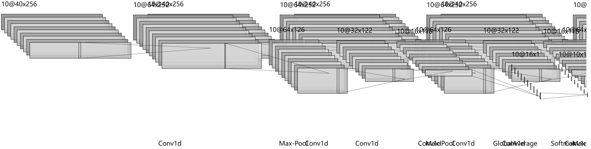

# Music-genre-classification
A conv1d neural network for music genre classification.
- Classify music files (mp3, wav and flac) based on 10 genres from GTZAN dataset.
- Use multiple layers of Conv1d Neural Nets and train model on Kaggle.
- Developed with Keras.

## Audio features extracted
Totally 40 features
- Chroma (12 features)
- Spectral Centroid (1 feature)
- MFCC (20 features)
- Spectral Contrast (7 features)

## Dependencies
All denpendencies for trainning model has fully provided in Kaggle environment. 

To run the model in local, listed denpendencies should be installed:
- numpy
- scipy -> for resample
- scikit-learn -> for data split and normalize
- librosa -> for feature extraction
- keras
    - `pip install keras`

To install all dependencies, run `pip install -r requirements.txt`

## Model structure

##  Apply the model
To classify the music file, run

`python3 runner_cnn.py cli -i='path/to/target_file.wav'`

To classify music files in batch, put all files in batch list folder and run

`python3 runner_cnn.py batch`

## Accuracy
At Epoch 400, training on Kaggle GPU:
|  | **Loss**  | **Accuracy** | 
| ----- | ---- | ----- |
| Training   | `0.1724`  | `0.9357` |
| Test | `0.8963`  | `0.7200` |

Confusion matrix and model accuuracy:
|                      | blues  | classical | country | disco  | hiphop | jazz   | metal  | pop    | reggae | rock   | Precision/User’s |
|:--------------------:|:------:|:---------:|:-------:|:------:|:------:|:------:|:------:|:------:|:------:|:------:|:----------------:|
| blues                | 17     | 0         | 0       | 1      | 1      | 2      | 1      | 0      | 5      | 0      | 62.96%           |
| classical            | 0      | 15        | 1       | 0      | 0      | 4      | 0      | 0      | 0      | 1      | 71.43%           |
| country              | 2      | 0         | 21      | 1      | 0      | 1      | 0      | 1      | 0      | 7      | 63.64%           |
| disco                | 0      | 0         | 0       | 20     | 1      | 0      | 1      | 1      | 4      | 2      | 68.97%           |
| hiphop               | 0      | 0         | 0       | 0      | 32     | 0      | 1      | 1      | 0      | 0      | 94.12%           |
| jazz                 | 1      | 2         | 0       | 0      | 0      | 21     | 0      | 1      | 3      | 0      | 75.00%           |
| metal                | 0      | 0         | 0       | 0      | 3      | 0      | 27     | 0      | 0      | 1      | 87.10%           |
| pop                  | 0      | 0         | 3       | 0      | 3      | 0      | 0      | 26     | 0      | 2      | 76.47%           |
| reggae               | 0      | 0         | 0       | 0      | 8      | 1      | 0      | 1      | 15     | 1      | 57.69%           |
| rock                 | 3      | 0         | 5       | 3      | 1      | 0      | 2      | 0      | 1      | 22     | 59.46%           |
| Precision/Producer’s | 73.91% | 88.24%    | 70.00%  | 80.00% | 65.31% | 72.41% | 84.38% | 83.87% | 53.57% | 61.11% | 72.00%           |

